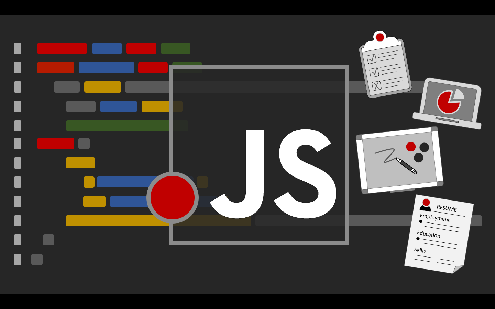

# Learn JavaScript from Scratch, Get Hired

This repository accompanies the "Learn JavaScript, Get Hired | The Full Bootcamp JavaScript" course by David Katz.

## Take the course here:
[http://udemy.com/learn-javascript-get-hired-bootcamp](http://udemy.com/learn-javascript-get-hired-bootcamp)

JavaScript is the most in-demand skill. Get an extra advantage with this course's special JS interview question videos.

In this course you will learn:
* the differences between function declarations, expressions, and arrow functions.
* when the `this` keyword is relevant.
* why and how almost everything is an object.
* a handful of ways to create object clones.
* constructor functions
* asynchronous code.
* a myriad of ways to write clean JavaScript code.
* intricacies of types - coercion, null vs. undefined, truthy, falsy, and more.
* the differences between let, const, and var.
* closures, function factories, and higher-order functions.
* prototypes and the prototype-based inheritance model.
* how to track code through the JavaScript runtime - through the callstack, heap, queue, and event loop.

***

## Starting point for most videos

#### Blank JavaScript Repl.it Template

[https://repl.it/@DavidJoseph3/new-browser-javascript](https://repl.it/@DavidJoseph3/new-browser-javascript)

***

## Starting points for interview question videos

####  Interview Question | The this keyword
[https://repl.it/@DavidJoseph3/interview-question-this-keyword](https://repl.it/@DavidJoseph3/interview-question-this-keyword)

#### Interview Question | Callbacks
[https://repl.it/@DavidJoseph3/interview-question-callbacks](https://repl.it/@DavidJoseph3/interview-question-callbacks)

#### Interview Question | JavaScript Types
[https://repl.it/@DavidJoseph3/interview-question-types](https://repl.it/@DavidJoseph3/interview-question-types)

#### Interview Question | Scopes and Hoisting
[https://repl.it/@DavidJoseph3/interview-question-scopes-hoisting](https://repl.it/@DavidJoseph3/interview-question-scopes-hoisting)

#### Interview Question | Cloning an Object
[https://repl.it/@DavidJoseph3/interview-question-cloning-an-object](https://repl.it/@DavidJoseph3/interview-question-cloning-an-object)

#### Interview Question | Closures, Higher-Order Functions, and Callbacks
[https://repl.it/@DavidJoseph3/interview-question-closures-higher-order-functions-callbacks](https://repl.it/@DavidJoseph3/interview-question-closures-higher-order-functions-callbacks)

#### Interview Question | Prototype-Based Inheritance
[https://repl.it/@DavidJoseph3/interview-question-prototype-based-inheritance](https://repl.it/@DavidJoseph3/interview-question-prototype-based-inheritance)

#### Interview Question | Asynchronous JavaScript
[https://repl.it/@DavidJoseph3/interview-question-asynchronous-code-js-engine](https://repl.it/@DavidJoseph3/interview-question-asynchronous-code-js-engine)
